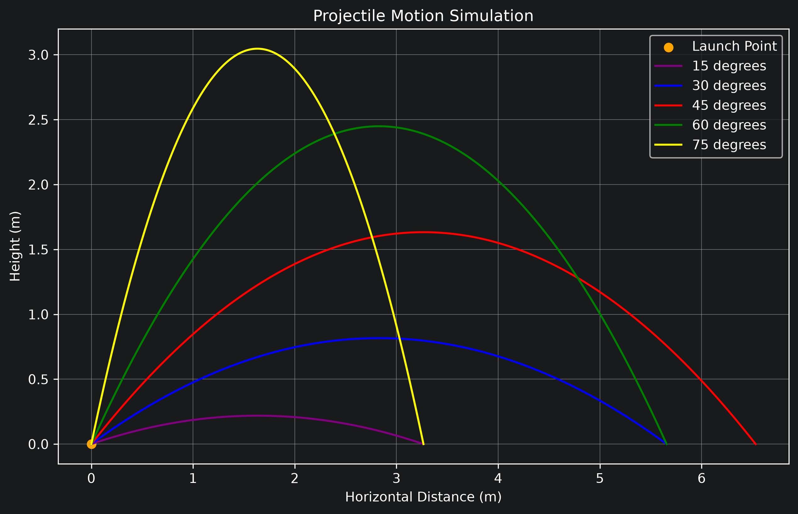
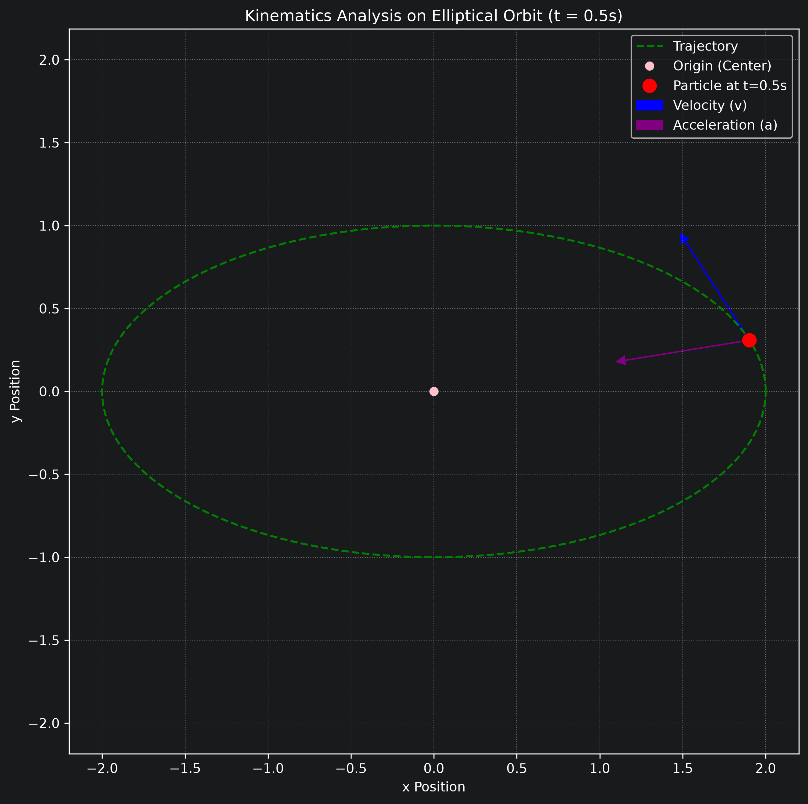

# Projectile Motion Simulation

## Overview

This project simulates projectile motion using Python.

The trajectories of projectiles launched at different angles are compared and visualized using Matplotlib.

## Skills

- Python
- NumPy
- Matplotlib
- Physics Modeling

## Features

- Compare different launch angles
- Plot projectile trajectories
- Mark launch and landing points
- Scientific visualization

## Preview

  
  

